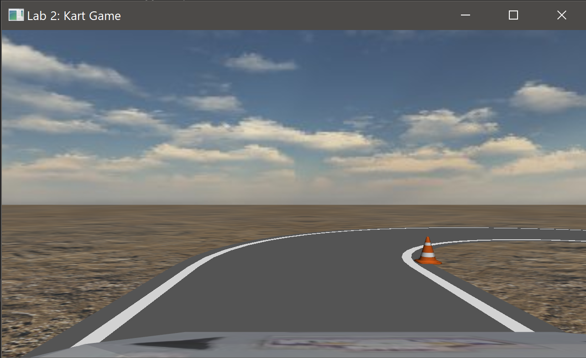
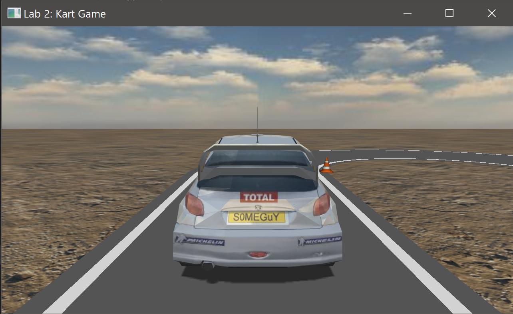
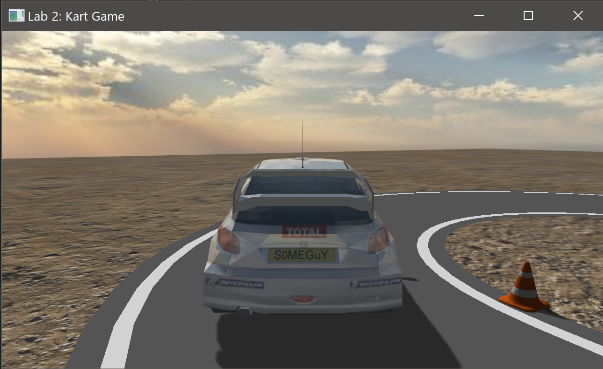

# CG Lab 2: Kart Game

## Functionality

* Model rendering with texture mapping
* Shadow mapping
* Cubemap for skybox rendering and reflection effect
* Kinematically-based driving control
* Three different views: spectator, driver, back

See [lab report](doc/report.md) for details.

## Build

* CMake
* GCC 8.1.0 (or other compilers that support C++14)

## Dependency

* OpenGL 4.2
* GLFW 3.3
* GLEW 2.1
* Assimp 5.0

## Demo

