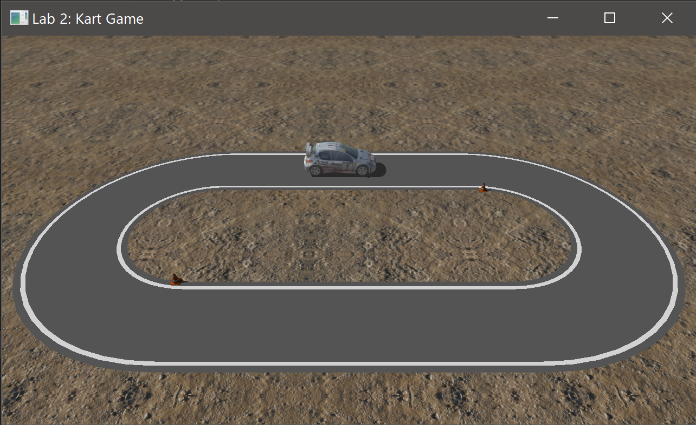
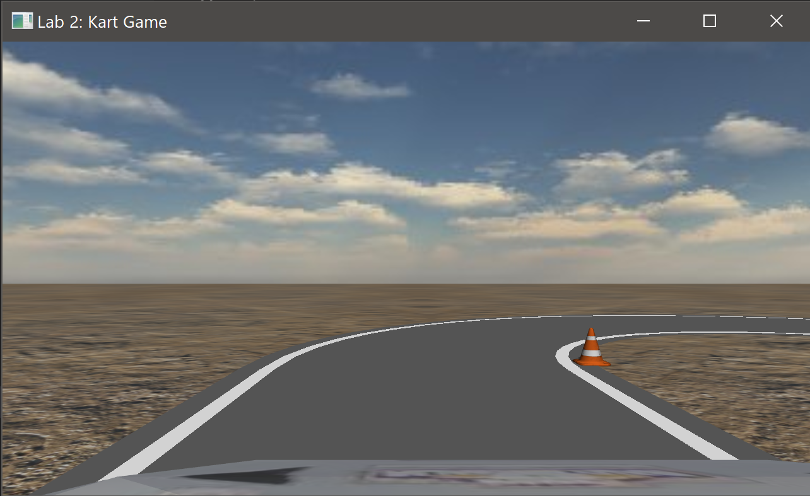
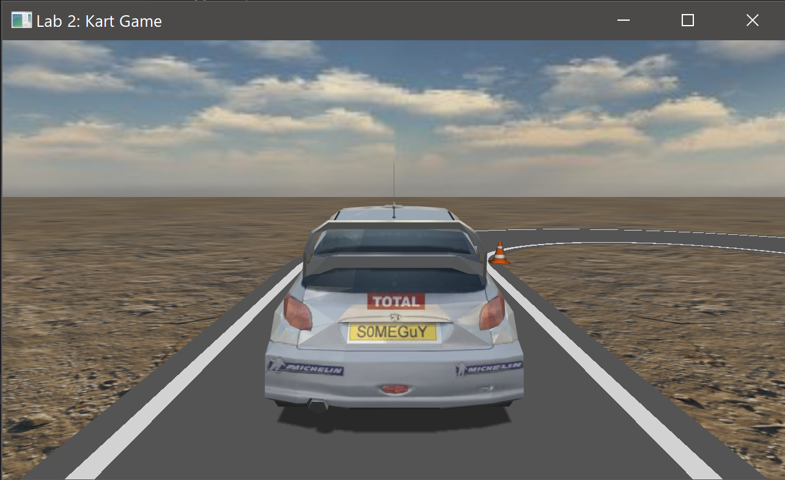
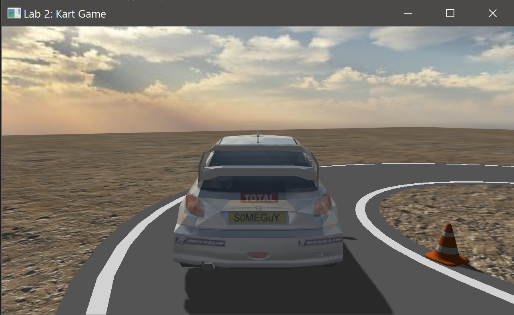
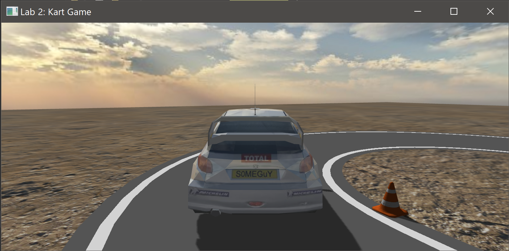

# 计算机图形学实验二：跑跑卡丁车

王梓涵 517021911179

## 实验准备

### 实验环境

* Windows 10 (1903) 64 位
* MinGW-w64 GCC 8.1.0

### 依赖库

- OpenGL 4.2
- GLFW 3.3
- GLEW 2.1
- Assimp 5.0

## 整体结构

本实验的源程序位于 `src` 目录下，由若干 C++ 类、函数，以及 GLSL 着色程序构成。程序执行的总体流程见 `KartGame.cpp`。下面将介绍其中的各部件的实现，注意这并非按照题目中得分点顺序展开。

## 模型生成与绘制

本实验中绘制的模型有赛车、车道、地面、锥形桶，其生成方式有加载自文件和过程化生成两种，但具有统一的存储方式和绘制过程。

### 数据存储

本实验延续了实验一中顶点属性+顶点索引的存储方式。但由于需要支持纹理映射，所以顶点属性中需要增加纹理坐标这一项，且在网格数据结构中还需要额外存储纹理的描述信息。由于纹理数据在读入后立即载入 OpenGL，所以不需要在内存中保存具体数据，只需要记录 OpenGL 返回的纹理编号即可。由于一个模型中可能有多个网格，所以需要建立一个上层的模型类来存储所有的网格。

### OBJ 加载

此次实验需要加载更为复杂的模型，比如一个 OBJ 中有多个网格，每个网格还有自身的材质信息，以及不同 OBJ 文件的数据组织形式可能不同。所以，实验一中的 OBJ 读取方式已经不能再使用。这里我参考了 [LearnOpenGL](https://learnopengl.com/) 中介绍的使用 Assimp 加载 OBJ 文件的方式，具体流程不再赘述。实验中赛车、锥形桶都使用这种方式生成。

### 过程化生成

已经固化的模型都可以通过读取 OBJ 文件的方式完成加载，但是一些需要经常调整的模型，最好可以通过程序内设定的参数直接调整其形态。在实验中，车道和地面都是通过过程化生成的。本实验中，车道的形状类似于田径场跑道，即由两段直道和两端半圆道组成。需要运用平面几何知识，分别计算内圈和外圈的顶点位置；法线为竖直向上；纹理坐标只用到一个维度，内圈为 0，外圈为 1。然后再通过定义顶点索引将这些顶点组成三角面。车道的纹理也是过程化的，利用一维纹理坐标，可以为道路画上白线。地面是一个简单的矩形，但是可以通过纹理缩放参数改变顶点的纹理坐标，从而控制贴图在地面上的大小。

## 环境绘制

### 立方体贴图

OpenGL 支持立方体贴图，通过指定立方体六个面的贴图就可以建立一个这样的贴图。在片元着色器中指定一个三维坐标，通过 `texture` 函数就能返回一个立方图贴图的采样结果。实验中，和环境绘制相关的天空盒以及环境映射都使用了立方体贴图。

### 天空盒

天空盒可以用来绘制非常远的场景元素，它们一般是固化在贴图里的。只要指定一个视线方向，并从立方体贴图中采样，就能得到对应远景的颜色。这里只需要绘制一个包围摄像机的立方体即可，但是有若干注意点：首先，它的位置（不包括旋转）必须相对世界坐标静止，不能跟着摄像机移动，所以观察矩阵里要去掉位移项；其次，它必须画在所有实体场景元素的后面，这个是通过顶点着色器里设置 z 坐标等于 w 坐标，以及深度测试函数里采用“小于等于”来实现的。

### 环境映射

立方体贴图还可以用于绘制表面反射环境的效果。在片元着色器中，利用 `reflect` 函数可以得到在某一法向量描述的平面上一入射光的反射方向，使用这一方向可以从立方体贴图中得到反射分量的颜色。这可以很容易地整合到模型的绘制过程中，从而增强模型的真实感。

## 光照与阴影

### 光源模型

本实验我采用的平行光源，而没有采用题目要求中建议的点光源，主要是因为背景天空盒是有日光的，而平行光源可以模拟日光。对于平行光，其光源方向是关键的参数，最好设置为和天空盒中的日光方向一致。

### 阴影贴图

在光栅化渲染中，阴影贴图是一种较为常用的绘制阴影的方法。其基本方法为讲光源视为摄像机，在光源空间绘制一遍场景，这一遍只记录深度信息，绘制的结果为深度图；在正常的绘制过程中，比较所需绘制的片元在光源空间的深度和深度图中的深度，来确定是否在阴影中。对于平行光而言，阴影贴图是一种便利的绘制阴影的办法，只需要设置好光源空间的观察矩阵和正交投影矩阵即可。

当然，阴影贴图这一方法会出现一些瑕疵，不过仍有解决办法。首先是物体表面出现黑色条纹，这称为自阴影，主要原因是阴影贴图分辨率不够，导致多个片元对应了阴影图的同一个像素。一般通过表面法向量和光源方向计算一个偏置，加在原有的深度图数值上。对于地面等不会投射阴影的表面，也可以通过在写入深度图时剔除前向面，来使其根本不出现在深度图内。还有就是锯齿状的阴影边缘，这是对阴影贴图的采样数不足导致的。解决方法和常用的抗混叠（通俗的说法是抗锯齿）方法相同，即对深度图的临近位置进行超采样。最后还有一个调整，即不在光源的观察范围内的片元应该直接剔除，避免多余的阴影及额外的计算。

## 视图与交互

### 摄像机视图

本实验中我完成了三个摄像机视图，分别为观众视图、驾驶员视图以及车后方视图，详见和运行示例。观众视图和驾驶员视图为题目中要求的视图，车后方视图是为了更好地观察模型绘制效果额外增加的。观众视图的观察矩阵为固定的，而驾驶员视图和车后方视图的观察矩阵依赖车辆的位置和方向。

### 车辆操控

车辆驾驶的按键方面和众多赛车游戏保持一致，W 为前进，S 为后退，A 为左转，D 为右转，空格为刹车。

车辆的驾驶手感对于整个游戏的交互体验起到了非常重要的作用，驾驶相关的逻辑和参数需要尽可能地模拟现实物理规律。对于直线行驶部分，需要引入运动学的速度、加速度等物理量以及考虑摩擦力的影响：前进指对车增加一个向前的加速度，后退指增加一个向后的加速度，刹车指减少速度的绝对值直到为零；在行驶的过程中，车辆持续受到与速度方向反向的摩擦力。

对于转弯，最精确的模拟应该是要考虑车辆的轮胎偏转造成的运动方向变换，但由于缺乏车辆的具体参数，难以进行这样的模拟。近似的方法是直接考虑车辆运动方向的角度变化，当按下转向键时，需要满足以下要求：车速为零时，不转向；随着车速增加，转向的角速度增加，但其阶数应小于车速。经尝试，发现 $\omega\propto\sqrt[3]{v}$ 为一较好的表达式。

## 运行示例

* 三种视图 

    

    

    

* 环境贴图、反射及阴影

    

* 拉伸窗口

    

